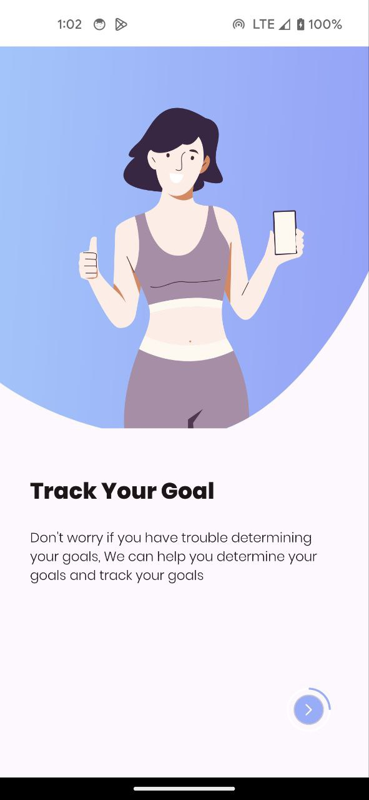
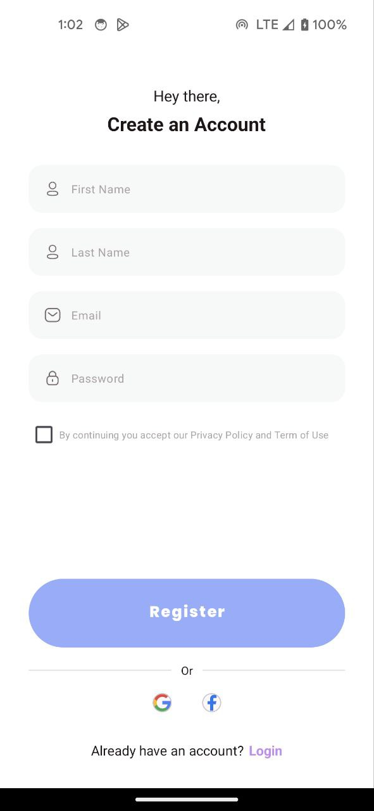
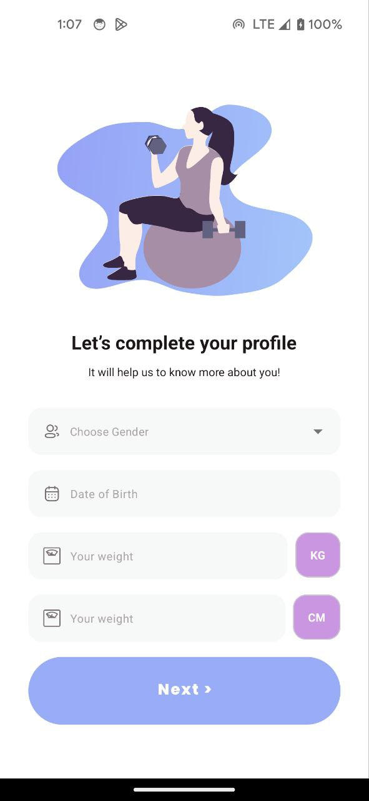
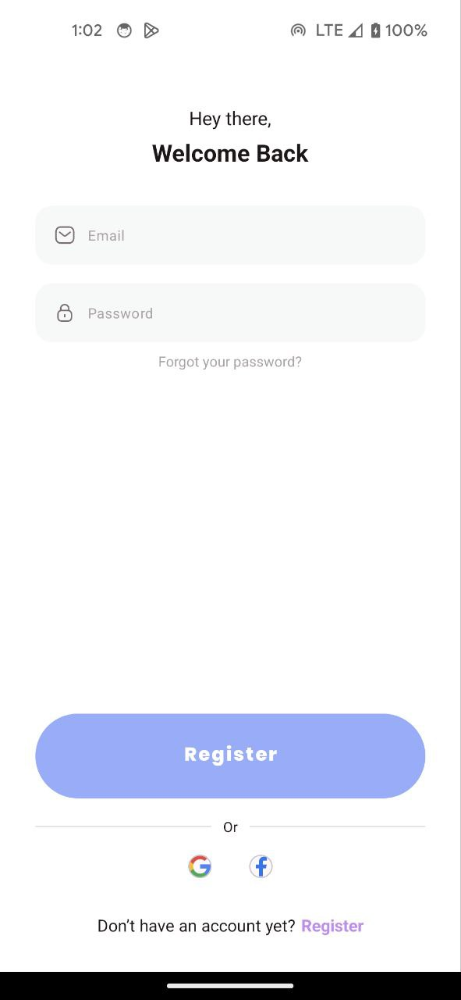

# FitnessX

FitnessX Application to track your workout process.

## Description

This project is done to deep my knowledge in Android Development. I am trying to apply more advanced 
stack of technologies to improve my technical skills. Applied Feature module architecture combined with
Clean Architecture. For navigation used Cicerone library.


 

 

 


### 1. Clone the repository

```bash
git clone https://github.com/SamSultanB/FitnesX.git
```

### 2. Access the application
Enjoy

### 8. License
This project is licensed under the MIT License - see the LICENSE file for details.